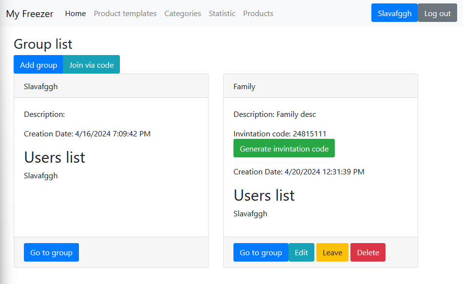
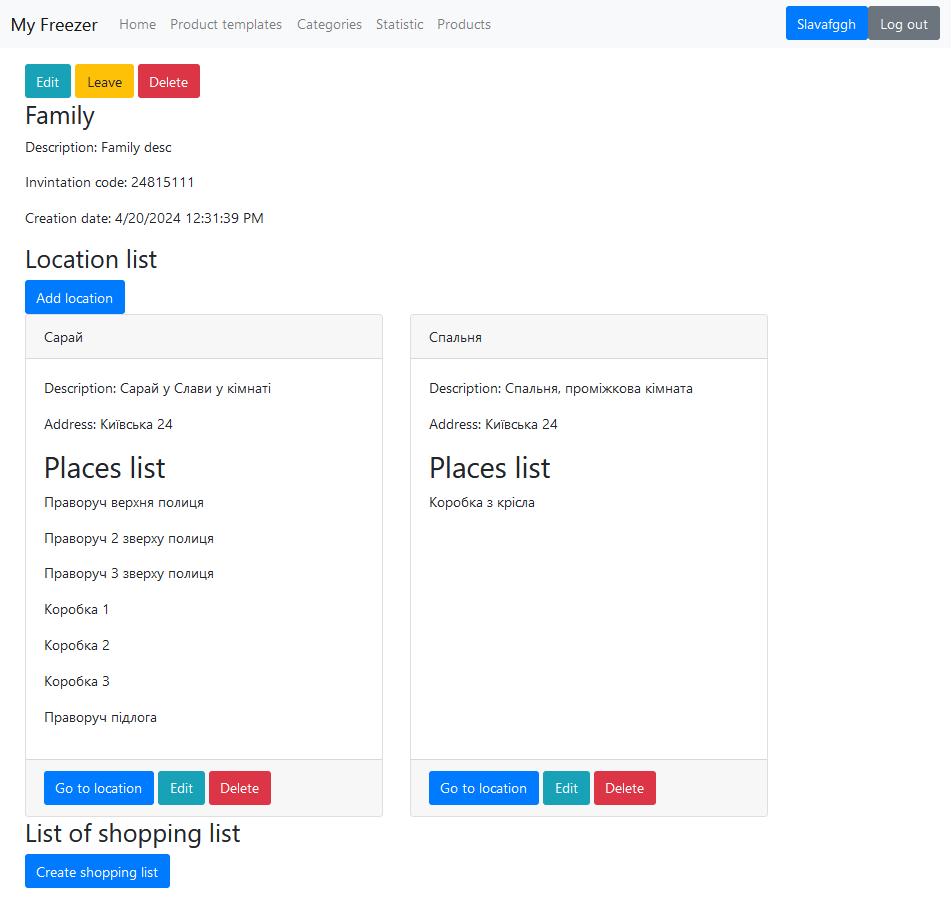

# Functionality

MyFreezer is a program for keeping track of household goods. You can create groups of users, create locations, and in
them - places. In which you can enter purchased goods with dates of manufacture and expiration. Create shopping lists.
For convenience, all products are divided into bases that can be conveniently reused.

Here is demonstration of home page

Here is demonstration of group page

# How to run

Ensure that you have Microsoft SQL Server installed on your system. If not, download and install it from the official
Microsoft website.

Clone the MyFreezer repository to your machine.

Open the solution file in Visual Studio or your preferred integrated development environment (IDE).

Navigate to the appsettings.json file in the MyFreezerApp project. Update the connection string under the "
ConnectionStrings" section to point to your MS SQL Server instance.

Via terminal go to MyFreezerApp folder. And run next command:

    dotnet ef database update

Execute [this sql script](./DataLayer/SQL/UserTriggers.sql) in created database. 

Run the application. Ensure that the API endpoints are accessible and that you can interact with the application without
encountering any errors.

# Architecture pattern

## Layered Architecture Pattern

Layered architecture pattern (also known as the n-tier or multi-layered pattern) is one of software development’s most
popular architecture frameworks. This pattern consists of a hierarchy of separate horizontal layers. Each of layers has
distinct advantages but works together as a single unit of software. Typically, a traditional layered architecture in
software engineering is classified into three tiers or more distinct layers:

* Presentation layer - [FrontEnd](./MyFreezerBlazorApp)
* Application (Business logic) layer - [BackEnd](./MyFreezerApp)
* Data Access - [Repositories](./DataLayer)
* Service layer - [Services](./ServiceLayer)
* Database

# Programming principles

## 1. DRY (Don't Repeat Yourself):

The DRY principle emphasizes the importance of code reusability. It states that every piece of knowledge or logic within
a system should have a single, unambiguous representation. By avoiding duplication, you reduce the chances of
introducing bugs and make your code easier to maintain and refactor.

* **Implementation**: The [UserToDto()](./MyFreezerApp/Controllers/UserController.cs#L63) method is used consistently
  throughout the code to convert a
  User object to a UserDTO object. This is a good example of DRY, as it avoids duplicating the conversion logic.

## 2. KISS (Keep It Simple, Stupid)

The KISS principle emphasizes simplicity in code design to make it more understandable and maintainable.

**Implementation**:

### 2.1. Simple and Clear Endpoints

The controller defines standard RESTful endpoints for basic CRUD operations (Create, Read, Update, Delete) on Place
entities:

* [GET: api/places](./MyFreezerApp/Controllers/PlaceController.cs#L28) - Retrieves a list of places with optional
  sorting and filtering.
* [GET: api/places/{id}](./MyFreezerApp/Controllers/PlaceController.cs#L56) - Retrieves a specific place by ID.
* [GET: api/places/getPlacesByLocationId/{locationId}](./MyFreezerApp/Controllers/PlaceController.cs#L67) - Retrieves
  places by a specific location ID.
* [POST: api/places](./MyFreezerApp/Controllers/PlaceController.cs#L80) - Creates a new place.
* [PUT: api/places/{id}](./MyFreezerApp/Controllers/PlaceController.cs#L88) - Updates an existing place.
* [DELETE: api/places/{id}](./MyFreezerApp/Controllers/PlaceController.cs#L99) - Deletes a place by ID.

### 2.2. Minimal Dependencies

The controller relies on a single repository
interface ([IPlaceRepository](./MyFreezerApp/Controllers/PlaceController.cs#L18)) to perform data operations. This
minimal dependency reduces complexity and makes the controller easier to maintain and test.

### 2.3. Concise Methods

Each method in the controller is concise, focusing on a single responsibility:

* They validate input parameters.
* Interact with the repository to perform data operations.
* Return appropriate HTTP responses.

This clear separation of concerns ensures that each method remains simple and easy to read.

## 3. SOLID Principles

### a. Single Responsibility Principle

Each class should have only one reason to change, meaning that a class should only have one job or responsibility.

* **Implementation**: The [DataContext](./DataLayer/Data/DataContext.cs) class contains only database-related fields and
  methods.

### b. Open/Closed Principle

Classes should be open for extension but closed for modification.

* **Implementation**: The [LocationLinqExtensions](./ServiceLayer/LinqExtensions/LocationLinqExtensions.cs) class
  adheres to the Open/Closed Principle by providing extension methods that add new functionality to existing classes
  without modifying their source code. This design ensures that the codebase remains flexible and easy to extend,
  allowing new features to be added with minimal risk of introducing bugs or breaking existing functionality.

### c. Liskov Substitution Principle

Objects of a superclass should be replaceable with objects of a subclass without affecting the functionality of the
program.

* **Implementation**: The [IProductRepository](./DataLayer/Repositories/Interfaces/IProductRepository.cs) interface and
  its implementation [ProductRepository](./DataLayer/Repositories/Implementations/ProductRepository.cs) are examples of
  adhering to the Liskov Substitution Principle (LSP).

### d. Interface Segregation Principle

Clients should not be forced to depend on interfaces they do not use.

* **Implementation**: The [IPlaceRepository](./DataLayer/Repositories/Interfaces/IPlaceRepository.cs) interface is
  designed with specific methods that directly relate to the operations on Place entities. It includes methods for
  adding, deleting, updating, and retrieving Place objects and PlaceDTO objects.

### e. Dependency Inversion Principle

High-level modules should not depend on low-level modules. Both should depend on abstractions.

* **Implementation**: The [PlaceController](./MyFreezerApp/Controllers/PlaceController.cs) class depends on
  the [IPlaceRepository](./DataLayer/Repositories/Interfaces/IPlaceRepository.cs) interface rather than a concrete
  implementation of a repository. This abstraction allows the controller to remain flexible and not tightly coupled to a
  specific data access implementation.

## 4. YAGNI (You Aren't Gonna Need It)

YAGNI emphasizes that functionality should not be added until it is necessary.

* **Implementation**: The [ShoppingProductController](./MyFreezerApp/Controllers/ShoppingProductController.cs) class
  implements only the essential CRUD operations that are currently needed.

## 5. Version Control

Version control systems like Git are indispensable tools for developers. They enable collaboration, facilitate code
reviews, and provide a safety net in case of mistakes or regressions.

* **Implementation**: While
  development [Gitlab repository](https://gitlab.com/2022-2026/ipz-22-4/varnavskyi-viacheslav/kursovi/myfreezer) was
  used.

# Design Patterns

## Adapter

Adapter pattern was needed, because controllers in some cases must return DTOs,
so [Mapper](./ServiceLayer/Services/Mapper.cs) class was created.

## Decorator

The Decorator Pattern allows behavior to be added to an object, either statically or dynamically, without affecting the
behavior of other objects from the same class.

In [GetCategoriesCountAsync](./DataLayer/Repositories/Implementations/CategoryRepository.cs#L65)
method, various extension methods are applied in a chain to achieve the desired result.

## Element of Chain of Responsibility

In [GetCategoriesCountAsync](./DataLayer/Repositories/Implementations/CategoryRepository.cs#L67-72) each extension
method
is responsible for handling a part of the request and passing it on to the next method in the chain.

## Strategy Pattern

The [RequestService](./MyFreezerBlazorApp/Services/RequestService.cs) class employs the Strategy Pattern to encapsulate
various algorithms (HTTP request methods) and make them interchangeable. Each method in RequestService encapsulates a
different strategy for handling HTTP requests, allowing the client code to switch between them seamlessly without
modifying the class itself.

## Template Method Pattern

The [RequestService](./MyFreezerBlazorApp/Services/RequestService.cs) class implements a template method pattern in
the [CheckResponseForErrors](./MyFreezerBlazorApp/Services/RequestService.cs#L21-31) method. This method defines
the skeleton of an algorithm for processing HTTP responses but delegates the implementation of error handling to
subclasses (or in this case, to the INotificationService).

# Refactoring Techniques

## Preserve Whole Object

Benefits:

* Instead of a hodgepodge of parameters, you see a single object with a comprehensible name.
* If the method needs more data from an object, you won’t need to rewrite all the places where the method is used—merely
  inside the method itself.

Example of this practice is [GetAllPlacesAsync](./DataLayer/Repositories/Implementations/PlaceRepository.cs#L49).

## Hide Method

Hiding methods makes it easier for code to evolve. When changing a private method, there is only needed to worry about
how to not break the current class since it's clear that the method can’t be used anywhere else.

Example of this practice is [GroupExists](./DataLayer/Repositories/Implementations/GroupRepository.cs#L293-296)

## Replace Error Code with Exception

Frees code from a large number of conditionals for checking various error codes. Exception handlers are a much more
succinct way to differentiate normal execution paths from abnormal ones.

Example of this practice is [LoginAsync](./DataLayer/Repositories/Implementations/AuthRepository.cs#L49).

## Remove Control Flag

Control flag code is often much more ponderous than code written with control flow operators.

Example of this practice is [break](./DataLayer/Repositories/Implementations/ProductBaseRepository.cs#L128)

